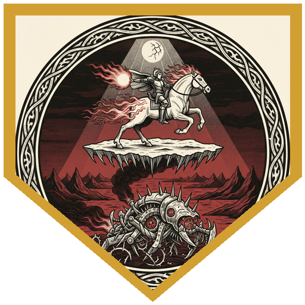
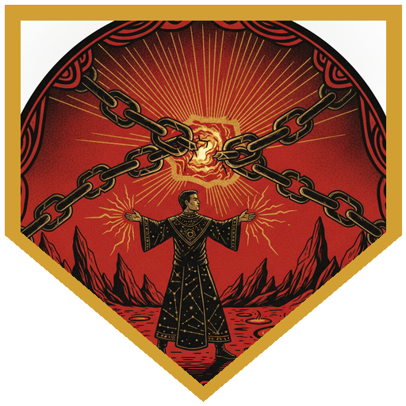
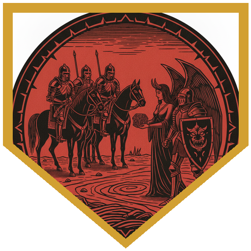
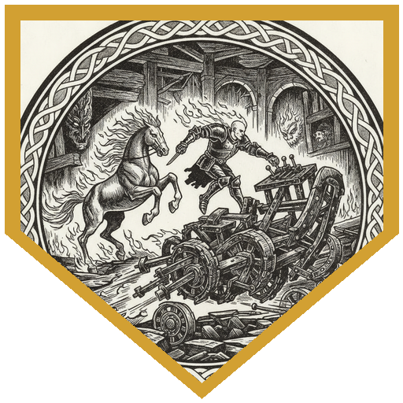
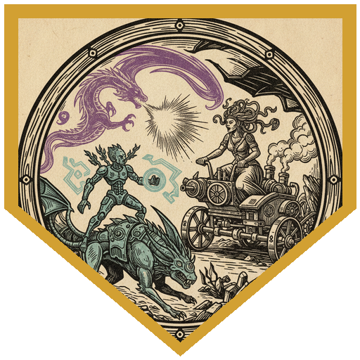

The Society of Sensation's planar pub crawl landed the party somewhere they were never meant to go: the Infernal Rapture, Mahadi's traveling emporium in Avernus. Satiny cushions, wines beyond any reasonable price, every vice offered before the thought was finished — until the bearded Calishite merchant himself appeared and explained the mistake. Their concierge, a succubus named Mizarella, had broken her contract, stolen his puzzle box and an infernal war machine, and fled with a paladin named Dudley. Mahadi offered a deal: a hundred gold each to bring back the box and the vehicle, another hundred each if they brought Mizarella back alive. The party mounted nightmares — intelligent fiendish horses with manes of living fire and a deep disdain for mortals and the pure of heart — and convinced most of the beasts they were headed for some quality violence. Tidus rolled a nine on his persuasion, earning a deliberately rough ride that required a Strength check just to stay seated.

They tracked the war machine through the red wastes on a high-flying dust search and spotted it: a four-wheeled monstrosity of twisted iron, Dudley manning the rear weapons and Mizarella driving. Dudley shouted "You will not take her, you fiends!" — and Perri fired the first of two fireballs from the sky, fulfilling his promise to the nightmare. Neko cast Jump and landed on the war machine, then used Thorn Whip to drag Mizarella out of the cockpit. Tidus boarded with an Athletics 25 and grappled Dudley. Lifeline activated starry form and peppered the driver with radiant arrows and a guiding bolt. Zavik called on the Blessing of the Raven Queen, fired from the dark, and took a smite from Dudley for thirty-one damage — thirteen slashing and eighteen radiant — halving the worst of it through his Raven Queen's protection. Tarrig burned a luck point to stick the landing, climbed into the cockpit, and brought the vehicle grinding to a halt.

Mizarella offered to surrender the puzzle box and the war machine if they let Dudley leave alive. She was a fiend — nobody trusted her — but Lifeline rolled a twenty-three on insight and found something unexpected: Dudley wasn't charmed. He was genuinely fighting for her, and she was genuinely willing to face Mahadi's punishment if it meant he could go free. "I think we're the bad guys, y'all," Neko said, and the party agreed to take the items and let the two of them escape toward the chains of Elturel. Then a second war machine screamed out of the dust — a Medusa in driving goggles, flanked by kobold-crewed bikes and a half-dragon that leaped onto their vehicle. The Medusa's petrifying gaze locked Tarrig in place; Neko dropped an upcast Moonbeam on the pursuers while Perri quickened a fireball that erased an entire kobold bike. Lifeline summoned a draconic spirit — amethyst, force-breathing — that tore through the remaining attackers and finished the Medusa with two rending strikes.

At the chains of Elturel — the broken remnants of the divine anchor that once held a city above the pit — Neko's entire build paid off. His portal sense found the residual rift immediately, and with starry form's dragon constellation ensuring he couldn't roll below a ten on Intelligence checks, the DC 20 Arcana check to crack the portal was a foregone conclusion. Mizarella and Dudley walked through to freedom, leaving behind Dudley's +2 shield bearing the symbol of Lathander and an invitation to their wedding. The party solved Mahadi's Sator Square puzzle box, found a contract and a statue of an erinyes inside, and returned the contents to the emporium for payment. The service was a clear step down from their accidental welcome, but still better than anywhere else on the crawl. When the emporium's 24-hour cycle ended, the world turned inside out like a bag, and the party found themselves standing in a Sigil street, a brochure for the Infernal Rapture fluttering at their feet.

---

## Player Highlights

<strong><a href="../characters/tarrig">Tarrig</a></strong> (Mike) — The smoldering-plate paladin/warlock, three pub crawls deep and treating Avernus like a workday. Burned a luck point to board the speeding war machine, climbed into the cockpit, and burned another to pass the Dex check that brought it to a halt. In the second fight he healed Mizarella with his necklace of prayer beads while restrained by the Medusa's gaze, then broke free with his last luck point. His free-action "Hey, why don't we talk?" before leaping onto a vehicle at eighty miles an hour set the session's tone.

<strong><a href="../characters/lifeline-mark-2-2024">Lifeline Mark 2 (2024)</a></strong> (Gon) — The cyan-gray autognome druid on her second pub crawl. Starry-form archer attacks and a guiding bolt kept pressure on Mizarella from the start, but her twenty-three insight check was the turning point — confirming the succubus was genuine and Dudley wasn't charmed. In the second fight she summoned a fifth-level draconic spirit that breath-weapon'd the pursuing vehicles and finished the Medusa with two rending strikes for twenty-two piercing.

<strong><a href="../characters/perri">Perri</a></strong> (Trey) — Told his nightmare he'd rain fire from above. The nightmare approved. Opening fireball for thirty-nine damage (half through Mizarella's resistance), then a quickened fireball in the second fight that atomized an entire kobold bike. Swooped down on Dudley mid-chase and asked "Cool sword — can I have it?" before swinging with mounted-combatant advantage. Cast Blade Ward during the lull between fights because the opportunity almost never comes up.

<strong><a href="../characters/zavik-ravenstep">Zavik Ravenstep</a></strong> (Mark) — Took Dudley's smite to the face — thirty-one damage, radiant and slashing — and halved the worst of it through the Blessing of the Raven Queen. Teleported adjacent to Mizarella to open with sneak-attack crossbow bolts, then switched to steady-aim shortbow fire in the second fight, putting the Medusa on the ropes before Lifeline's dragon finished the job.

<strong><a href="../characters/tidus">Tidus</a></strong> (Ttrpger) — The fire-aesthetic dwarf samurai, along for the ride in the most literal sense: his persuasion nine earned the nightmare's active contempt, and he spent the first round white-knuckling the reins. Once aboard the war machine on an Athletics 25, he grappled Dudley to keep the paladin from swinging freely, then splashed holy water on the succubus — which she dodged with a twenty-seven Dex save, because of course she did.

<strong><a href="../characters/neko">Neko</a></strong> (Ken) — "Where we're going, we'll need guns — lots of guns." The portal-cracking planar philosopher jumped onto a speeding war machine, Thorn Whipped the succubus out of the cockpit, then deployed upcast Moonbeam and starry-form archer fire against the second wave. His defining moment came at the chains of Elturel: portal sense found the rift, dragon-constellation starry form locked his Intelligence floor, and the DC 20 portal cracked without a fight — the payoff his entire character build had been waiting for.

---

## Achievements

<strong>I Made a Promise</strong> — Perri told his nightmare he'd rain fire from above. He delivered: an opening fireball for thirty-nine damage from the sky, then a quickened follow-up in the second battle that erased an entire kobold bike in a single blast.

<strong>Portal Cracker</strong> — Neko's entire character build paid off at the chains of Elturel. Portal sense found the rift instantly, dragon-constellation starry form ensured he couldn't roll low enough to fail, and the DC 20 Arcana check fell without a fight. The DM's reaction: "This is literally one that has a benefit for that."

<strong>Are We the Bad Guys?</strong> — Riding fiendish nightmare mounts in the service of a devil merchant, hunting down a succubus — only to learn through Lifeline's insight check that Mizarella genuinely loved Dudley and was willing to face punishment so he could go free. "I think we're the bad guys, y'all."

<strong>Stop the Machine</strong> — Tarrig burned a luck point to board the speeding war machine, climbed into the cockpit, and burned another to pass the Dex check that brought it grinding to a halt — one turn, two luck points, problem solved.

<strong>Draconic Intervention</strong> — Lifeline summoned a fifth-level draconic spirit — amethyst, force-breathing — that swept the pursuing vehicles with its breath weapon and finished the Medusa with two rending strikes for twenty-two piercing damage.

---

## Rewards

- **Gold**: 283.33 gp each
- **Downtime**: 10 days
- **Advancement**: level (optional)
- **Streaming hours**: 2
- **+2 Shield (Beacon)** *(rare)* — This shield's wielder can take a Bonus Action to cause it to shed Bright Light in a 10-foot radius and Dim Light for an additional 10 feet, or to extinguish the light. Bears the rising sun symbol of Lathander; any large temple can reconsecrate it to another deity with a tenday ritual and 500 gp in incense. Given by Dudley as thanks for letting him and Mizarella go free.
- **Oil of Slipperiness** *(uncommon)* — Contained in a metal can covered with a patina of old rust that conceals any label it may have once had. Salvaged from the Medusa's war machine.
