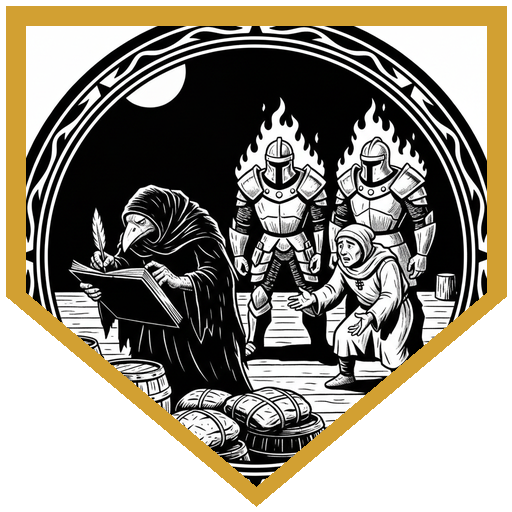
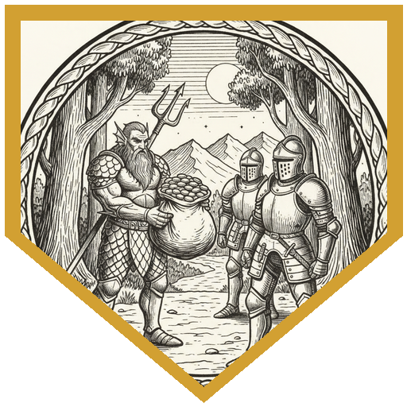
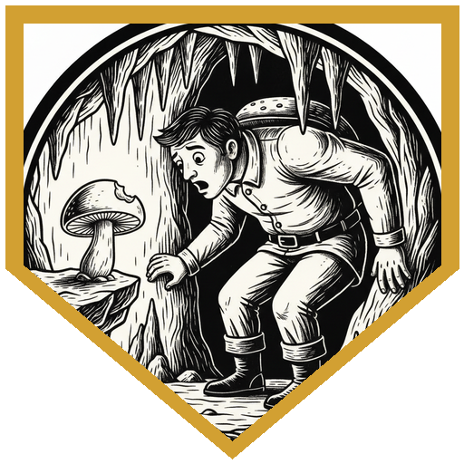
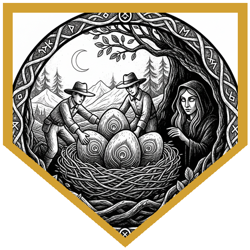
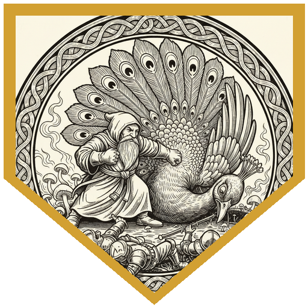

Grand Duke Ulder Ravengard did not want a protection racket wearing Flaming Fist colors. He wanted evidence — names, if possible, living witnesses — and he wanted a merchant named Skunkin' Mell to come back from the Cloakwood in one piece. Mell's job sounded simple: peacock eggs, a thousand gold on safe return, five hundred as a down payment at the docks. The party took the law-and-guard hook instead of the guild's. Darkwing Ducken put it plainly: this duck flaps only for justice.

Manip Caius and two fists — Olin and Theia — swaggered in before Mell had finished handing over the coin. Five thousand a egg, they said. Loophole in the city's "nothing larger than a peacock" ordinance. Extra work for the guard. Stretch the law one way, expect it stretched the other. Darkwing wrote it all down, including the thesis: two wrongs make a right. Zalen talked them out of the paperwork trap; they still came along as "supervisors." On the road, Flames Auda and Erland tried the same shake for a sixty-forty cut and a hundred-gold deposit. Undyne paid a thousand and took the potions. Erland's warning was the part that mattered: a friend named Cato had died with mushrooms bursting out of him, a grimy dark-haired woman had fled, and Mell was going to steal from a druid.

The nest was in a cave, which peafowl do not do. Tracks the size of a house. A feather to match. Barefoot humanoid prints that grew talons and took flight. Cedric's Nature twenty-nine confirmed how wrong it was; Happy had been uneasy about stealing eggs since the docks. They went in anyway. Cedric bit a mushroom — eat me, drink me — and grew a size, then another. Solana and Undyne shrank. Cedric put the peahen to sleep on a Wisdom DC 18; she had no legendary resistance to spend. Solana shoved her five feet when the DM rolled a one, grabbed an egg, and Step-of-the-Winded out. Darkwing Shadow Stepped for another. Undyne raged at Small size and took a third. Brand Sr. dashed for a fourth.

Then the mate arrived. Mushroom breath dropped Mell and the three fists; they got back up as shambly, acid-burned mushroom undead. The shadowy druid Murgan came in on the squawk — hypnotic pattern, Crackling Wave, spectral claws — and promised to murder whoever they sold the eggs to. Happy sunbeamed her, sculpting the line around Cedric and Solana. Darkwing dropped darkness and stunned mushroom-Mell. Brand punched undead until he had to leave. Murgan vanished after a threat in the language of peacock. Solana stood up from prone and knocked the peacock unconscious; the undead dissolved with it.

They put the eggs back. Happy had never liked the job. Darkwing would not put customers on a druid's kill list. Cedric spent diamond dust to revivify Mell, Caius, Olin, and Theia. Mell blubbered about leaving the trade; Caius swore off bribes; Olin was thankful to be alive; Theia confessed she had been Erland and Auda's spy and produced a book of names. Cedric handed Caius a Bahamut emblem. Darkwing recommended merch. Ravengard paid for plumage, spores, and a cube from the druid's corner of the cave — not for eggs.

---

## Player Highlights

<strong><a href="../characters/happy-go-lucky">Happy Go Lucky</a></strong> (Don) — Five-leaf clovers for everyone, including the chief of police, then a quiet objection that stealing a peahen's eggs did not feel right. Cast Rary's Telepathic Bond before the cave (the DM granted combat advantage for the prep). When Murgan arrived he sunbeamed her — twenty-eight radiant, sculpted around Cedric and Solana — drank a potion of invulnerability, and voted to put the eggs back.

<strong><a href="../characters/darkwing-ducken">Darkwing Ducken</a></strong> (Ken) — "I am the shadow that flaps in the night. I am the reference that reminds you of the nineties." He transcribed Caius's entire shakedown, annotated "two wrongs make a right," then used his Baldur's Gate folk-hero feature so commoners would inconvenience the Fist with testimony. In the cave he Shadow Stepped for an egg, dropped darkness, and stunned mushroom-Mell on a Con save of twelve. He would not sell eggs to people a druid had promised to murder; he did offer Caius a line of Darkwing merch for turning over a new leaf.

<strong><a href="../characters/cedric-2026">Cedric 2026</a></strong> (Trey) — Nature twenty-nine on the peafowl, then a bite of mushroom because the worst that could happen was getting bigger. It did. Twice. Extra force on the stick. Sleep dropped the peahen on DC 18 when she had no legendary resistance to burn. After the fight he spent diamond dust to revivify Mell and the guards, told Caius that Bahamut was his new friend, and handed him an emblem to wear.

<strong><a href="../characters/undyne">Undyne</a></strong> (Ttrpger) — When Flames Auda and Erland wanted sixty percent and a friendly deposit, she rooted through her bag and asked whether a thousand gold would do the trick. It did. In the cave the spores shrank her a size category; she raged anyway, walked to the nest with Strength 25, and left with an egg.

<strong><a href="../characters/brand-sr">Brand Sr</a></strong> (Mike) — Offered dust of disappearance and a smash-and-grab before anyone had committed to Sleep. When the hen was down he Step-of-the-Winded eighty-five feet, took an egg, and got out. On the mushroom-undead he hit a twenty-five for fourteen force, spent a stunning strike they saved on an eighteen, then hit a nineteen for eighteen more before he had to leave the table.

<strong><a href="../characters/zalen-ashar">Zalen Ashar</a></strong> (Mark) — Talked both Fist shakedowns into standing down — "why can't we all make money" — with Cedric stacking guidance on the rolls. Aid at fourth level on himself, Darkwing, and Solana before the cave. Mage Hand was not enough to lift a house-egg. Spirit Shroud and a nineteen into an undead; the twenty-five that would have hit Happy's unbuffed AC missed after Zalen's ally Shielded to twenty-six. (That Shield was Happy's.)

<strong><a href="../characters/solana-aefir">Solana Aefir</a></strong> (Gon) — First into the nest: a gentle shove that the peahen failed on a natural one, one oversized egg, Step of the Wind out. Spores shrank her; Murgan's legendary claws put her prone and kept hitting. She stood up, punched the peacock for thirty-four, flurried force, and dropped it unconscious — nonlethal — which ended the fight and dissolved the undead. Then she talked about going back to help the forest grow.

---

## Achievements

<strong>Two Wrongs Make a Right</strong> — Manip Caius explained that if Mell could stretch Baldur's Gate law by breeding giant peacocks, the Fist could stretch jurisdiction the same way. Darkwing wrote it down, had him review the transcript, and summarized the doctrine: "Very wise flaming fist says two wrongs make a right."

<strong>A Thousand Gold Does the Trick</strong> — The second Flaming Fist stop wanted sixty percent of Mell's take and a hundred-gold deposit. Undyne asked what smelled, rooted through her bag, and held out a thousand gold. They took it, handed over a potion of psionic fortitude and a potion of pugilism, and let the party go.

<strong>Eat Me Makes Me Bigger</strong> — Cedric saw the nibbled mushrooms by the nest, quoted Alice, and took a bite. Size category up, extra d10 force. Then he stayed close enough to grow again. "Holy shit, if only I was a weapon guy" — then he hit Murgan with the stick for thirty-one, nine of it the mushrooms' force.

<strong>Put Them Back</strong> — Murgan promised to murder whoever bought the eggs and to keep returning them to the nest. Happy had not liked the job since the docks. Darkwing would not put customers on a kill list. The party left the eggs, took plumage and spores, and still got paid — just not for poaching.

<strong>Nonlethal</strong> — Solana stood up from Murgan's prone-lock, punched the house-sized peacock, and specified nonlethal. It dropped. The mushroom-undead dissolved with it. Combat ended on a punch that was trying not to kill the thing they had come to rob.

---

## Rewards

- **Gold**: 2857.14 gp
- **Downtime**: 10 days
- **Advancement**: level (optional)
- **Streaming hours**: 2
- **Potion of Psionic Fortitude** *(uncommon)* — Advantage for 1 hour on saves to avoid or end Charmed or Stunned on yourself. Black, swirling with pink and purple flecks. *(Phandelver and Below)*
- **Potion of Pugilism** *(uncommon)* — For 10 minutes after drinking, each Unarmed Strike deals an extra 1d6 Force on a hit. Thick green fluid that tastes like spinach. *(DMG 2024)*
- **Potion of Growth** *(uncommon)* — Gain the Enlarge effect of Enlarge/Reduce for 1d4 hours (no Concentration). Harvested from Cloakwood spores; the red in the yellow beads expands into a humanoid figure and contracts. *(DMG 2024)*
- **Au Naturel** *(Temperate Cube of Summoning)* *(rare)* — A Tiny jack-in-the-box. Wind the crank as a Magic action: a merry tune, the lid pops, a creature appears in the nearest unoccupied space, the lid closes. Casts a random 5th-level summon (1d6: Aberration, Beast, Construct, Dragon, Elemental, Fey; save DC 17, +9 attack) without Concentration; you still count as the caster. Once until next dawn. *Temperate:* unharmed by temperatures of 0°F or lower and 100°F or higher. *(DMG 2024)*
