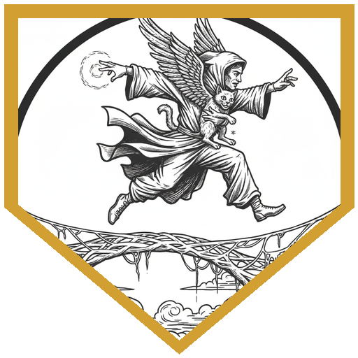
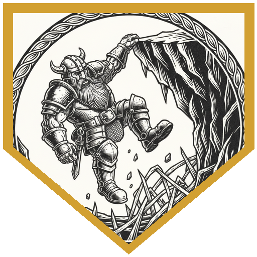
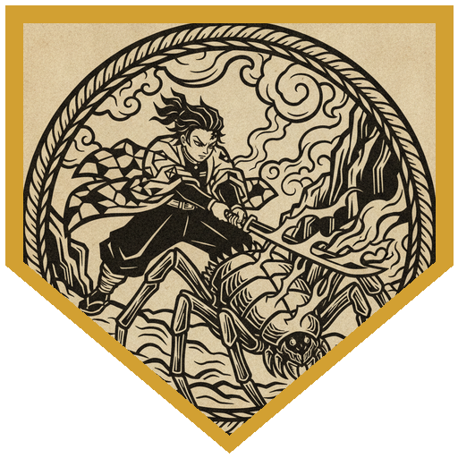
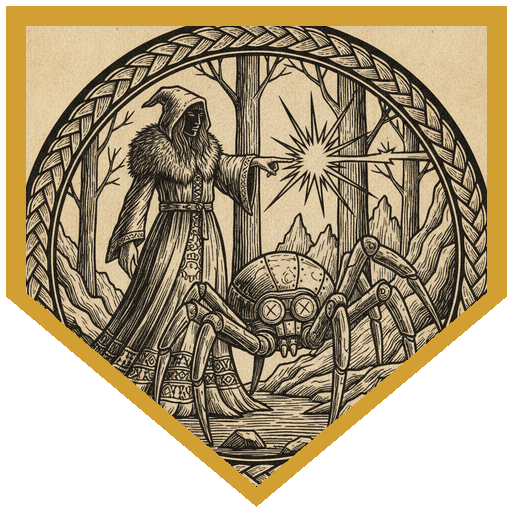
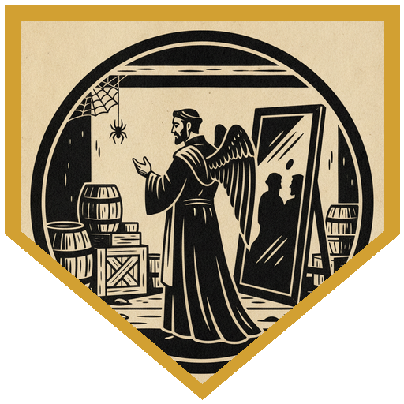

The Society of Sensation's planar pub crawl went to the Abyss this time, which is not a sentence that improves with thought. Ten gold bought a ticket, a matching tabard, and a storeroom under Sigil's Civic Festhall where they put out the lanterns one by one and told you to stare into a mirror of polished obsidian until something stared back. What came through on the other side was Duskhaven — driftwood shacks piled on driftwood shacks, webbed together just enough, under an endless dark sky. The Mask and Dagger served beer brewed from fermented mushrooms. A small half-drow named Jarrick Dusksilver had the only free table in the place, because nobody in Duskhaven would sit with him. The village keeps to Vhaeraun, god of thieves, and not to Lolth — and enough of the neighbours had decided that was exactly why a monstrous spider had started killing them. Jarrick was one of the few whose faith went far enough to try to fix it: he organised a hunt, hired the famous hunter Tanar Kilmire to lead it, and then ran. Five hundred gold and a spell scroll of spider climb for the beast, or failing that, for four signet rings. Dan then remembered the part he'd forgotten last time: no teleportation of any kind works in the Demonweb. Not Misty Step, not Dimension Door, not racial. Mattrum, a portal jumper, took this poorly.

The web paths were slabs of stone roofed and walled in silk, ten feet by ten, with no landmarks worth the name; a run of survival checks decided how long the party spent lost, and Orsy landed the success that closed it out. An hour in, a wagon hung wedged in the webbing with a desiccated rothé still in its harness. Yarik crawled under it through the dirt on the grounds that a barbarian does not mind dirt, and felt the small spiders walking up his arms the whole way. Kenjiro cast Freedom of Movement, went over the top instead, found the wagon long since looted — and caught a huge shadow moving somewhere above the layers of web, gone before anyone could look at it properly. An hour after that, a bundle hung on a thread from a hole in the ceiling sixty feet up. Inside was Seffril Mojanni, dead, stippled with hundreds of tiny puncture wounds, wearing an iron ring stamped with a tarantula. Valintino took the ring. Then the webbing gave a pop like a snapped cable, and the entire walkway began to slide into the mist.

The teleport ban started mattering immediately. Mattrum pointed out that Jump is not teleportation magic, grabbed his winged cat, and went fifty feet plus a dash. Yarik climbed at forty. Orsy dashed and climbed. Tidus rolled an 11, took the cat's +2 and still came up short, then spent Tactical Mind for a d10 and made it. Hedy cast Fly on herself, got no volunteers, and hauled Valintino up by the armpits. Kenjiro said "Nezuko, I need your help," and his sister came out of the box on his back as a giant celestial thing and carried him clear. Beyond that was the *Valiant Heart*, a Baldur's Gate galleon that had been plucked out of its own world and torn open by something that walked in without ducking. They went in through the hull, into the dark, through the cobwebs and the skittering, and found a cocoon in the old cargo hold that was screaming through its gag. Valintino cut it open and swarms came pouring out; his Spirit Guardians dropped all four to a wisdom save they had no chance at, Hedy finished one with a cantrip, and Mattrum closed it with a lightning bolt carefully bent around every ally present — including, as he declared, the elf. Yirulle Kirresh had been three days in the web. The beast, she said, had eyes like flames and a shell harder than steel; it paralysed her, and the little ones carried her off. She gave them a pouch of diamond dust.

Further on, under a heap of dead giant spiders, Garm Uthril lay with a hole punched clean through his torso. Kenjiro's medicine check came up 28: not pincers, not a tear, nothing serrated — a clean sharp edge, and something circular, which is a strange shape for a weapon. Then a voice spoke in Valintino's head and asked whether he bore Lolth's favour and had come to enact her vengeance. Mattrum answered it in Elvish — *no, I see you, you're found* — and a drider came out of the webs: a former priestess of Lolth, exiled for loving her community more than her goddess, living out her punishment in a village of the punished. The beast, she explained, was a retriever, one of Lolth's constructs, sent out to take her enemies. It had stopped discriminating. It was eating her people too. Kill it, she said, and we can go back to serving the sentence we earned. At the ruined temple an hour later the tracking symbols carved into the web thinned out and started being accompanied by drawings of spiders with their legs torn off and their eyes carved out. Then the web began to wobble like a plucked string, the eight-foot spiders scattered in a panic, and a massive dark shape came down through it on scythe-like talons with seven red eyes.

It webbed people, hit hard, and shrugged off most of what a party throws at a construct — immune to paralysis, exhaustion, charm, stun, and psychic damage. Hedy found the gap: it was not immune to *incapacitated*, and Psychic Lance at DC 20 took its turn away outright. After that it was arithmetic. Mattrum threw a fireball with Careful Spell and then a lightning bolt down a line that killed everything it touched. Kenjiro spent a Lucky, crit with a radiant flaming sword, stacked a fourth-level Searing Smite and Elemental Adept on top of it, and read out sixty-nine points of fire. Tidus fought his way around the corner and got one hit in with Strike of the Giants before he had to leave for the night. Yarik raged, got webbed, broke out, got webbed again. Orsy kept Bless running and put a third-level Dragon's Breath on her owl, which could only fly ten feet up before the webs got too thick to pass. Valintino dropped Bigby's Hand on it. When it fell, its mandible came off as a rod, and its seven ruby eyes came out as payment — one of which the party had already been carrying since the drider's clearing, an apricot-sized ruby with a dagger buried in it. A sword of extraordinary elven age had been driven through the heart of the temple's defaced statue; that went in the bag too. Tanar Kilmire came home alive, Yirulle with him, three rings recovered. Duskhaven threw a celebration and swore they would never take the party's coin at the bar again. Jarrick Dusksilver, blamed either way, eventually left town and walked off into the Demonweb to find somewhere to be ashamed in private. And when they squeezed back through the starlight doorframe into the storeroom in Sigil, a tiny black spider was sitting in a web in the corner, watching Valintino.

---

## Player Highlights

<strong><a href="../characters/valintino">Valintino</a></strong> (Pete) — Opened the cocoon on the <em>Valiant Heart</em> with a dagger and ate the consequences: four swarms boiling out, one straight up his arm for 4. Answered with Spirit Guardians at third level, carved to exclude the party and the prisoner, and the DC 17 save went 0-for-4. He took the first signet ring off Seffril Mojanni's body, rode up out of the collapse in Hedy's arms, and was the one the drider spoke to in his own head — the one wearing Lolth's smile. The tiny spider in the Sigil storeroom was looking at him, too.

<strong><a href="../characters/mattrum">Mattrum</a></strong> (Trey) — "One of the nifty things about teleportation magic is Jump is not that." Fifty feet plus a dash off a collapsing walkway with a winged cat under one arm. Bent a lightning bolt around five friends and then extended the courtesy to the drow they were rescuing: "I deem that elf is one of my friends today." Did the same with a fireball in the temple to spare Kenjiro's summon, then found a line that caught all three spiders and killed all three — 33 to the first and more than enough for the rest. Also the party's Elvish: he was the one who told the drider <em>no, I see you, you're found</em>.

<strong><a href="../characters/tidus">Tidus</a></strong> (Ttrpger) — Rolled an 11 on the climb with the walkway sliding out from under him, took Mattrum's cat's +2 and was still short, then burned Tactical Mind for a d10 and pulled himself over. In the temple he worked around the corner to reach the retriever, missed twice, connected once, and poured Strike of the Giants fire into it — remembering afterward that his maul had Topple, which the construct then saved against on a DC 14. He called his shot before he left: probably the only turn he'd get tonight.

<strong><a href="../characters/hedy">Hedy</a></strong> (Gon) — Rolled portents of 10 and 11 at the table and spent the 10 later to turn a Dex save into a 15. Kept Detect Magic running through the web paths on a firbolg free casting. Cast Fly on herself during the collapse, asked who wanted a lift, got silence, and carried Valintino out under his arms anyway. Then the fight: she checked what a retriever was actually immune to, worked out that <em>incapacitated</em> wasn't on the list, and landed Psychic Lance at DC 20 — no damage, the thing being immune to psychic, but it lost its action entirely.

<strong><a href="../characters/kenjiro">Kenjiro</a></strong> (Ken) — Came to the Abyss looking for demons to slay and declared the retriever close enough. Freedom of Movement up the wagon, a 28 medicine check that read the clean circular wound in Garm Uthril's chest, and Nezuko out of the cube of summoning twice — once to fly him clear of the collapse, once as an aberration in the temple. His big turn: a Lucky, a crit with a radiant flaming sword, a fourth-level Searing Smite for 46 more fire, three 1s bumped to 2s by Elemental Adept. Sixty-nine. Nice. It survived. He then crit again cutting himself out of the webs.

<strong><a href="../characters/orsellia-fiddlesteps">Orsellia 'Orsy' Fiddlesteps</a></strong> (Lazarus) — Landed the survival success that finished the party's navigation through the web paths, and cast fourth-level Aid and Mage Armor on the lowest-HP members before anything had gone wrong. In the temple she kept Bless up — the d4 on attacks, checks and saves — then put a third-level Dragon's Breath on her owl and sent it up, where it learned the webs stop being passable after ten feet. Cold breath from a hovering owl anyway.

<strong><a href="../characters/yarik-wolfshadow">Yarik Wolfshadow</a></strong> (Mark) — Went under the blocked wagon on his belly through the dirt and the spiders, because he's a barbarian and doesn't mind dirt. Volunteered to be up front and was rewarded with being the spider's first, second and eventually third choice of web target: Danger Sense advantage turned into disadvantage by DM whim, a 22 that became an 18 and hit anyway. Raged into bear form for the extra resistance, missed the metal thing with the warhammer twice, spent an action tearing out of the webbing and a bonus action keeping the rage alive, and got back in line.

---

## Achievements

<strong>Jump Is Not That</strong> — The walkway let go and the teleport ban became everyone's problem at once. Mattrum's answer: "One of the nifty things about teleportation magic is Jump is not that." Fifty feet of leap, thirty of dash, a winged cat under one arm, and no part of it a spell the Abyss was blocking.

<strong>Tactical Mind</strong> — Tidus rolled an 11 on the climb. Mattrum's familiar gave him +2 and it still wasn't enough. So he spent Tactical Mind, added a d10, and got over the lip — the difference between the party and the mist being one resource he decided to spend immediately.

<strong>Sixty-Nine, Nice</strong> — Kenjiro spent a Lucky, crit with a flaming radiant sword, added a d8 of cleric damage and a fourth-level Searing Smite, then Elemental Adept turned three 1s into 2s. He counted it out loud: "So it's sixty-nine, nice." The spider lived.

<strong>Not Immune to Incapacitated</strong> — The retriever shrugged off paralysis, exhaustion, charm, stun, and psychic damage. Hedy cast Psychic Lance at DC 20 anyway, because immunity to the damage isn't immunity to the rider. It failed. It dealt zero damage and cost the construct its entire turn.

<strong>Lolth's Smile</strong> — A voice in Valintino's head asked if he carried Lolth's favour and had come to enact her vengeance. It was the drider, and the answer kept everyone alive. It was also, apparently, a mark — because the tiny black spider in the Sigil storeroom on the way home was watching him and nobody else.

---

## Rewards

- **Gold**: 357.14 gp
- **Downtime**: 10 days
- **Advancement**: level (optional)
- **Streaming hours**: 2
- **+2 Rod of the Pact Keeper** *(rare; requires attunement by a Warlock)* — +2 to Warlock spell attack rolls and save DCs; regain one spell slot as a Magic action, once per Long Rest. **Harmonious**: attunement takes only 1 minute. A curve of black iron that was once the mandible of a metal spider, and takes to a new hand as though it wants to be used. *(DMG 2024 p. 301)*
- **Spell Scroll of Spider Climb** — Jarrick's down payment, handed over in the Mask and Dagger before anyone had agreed to anything.
