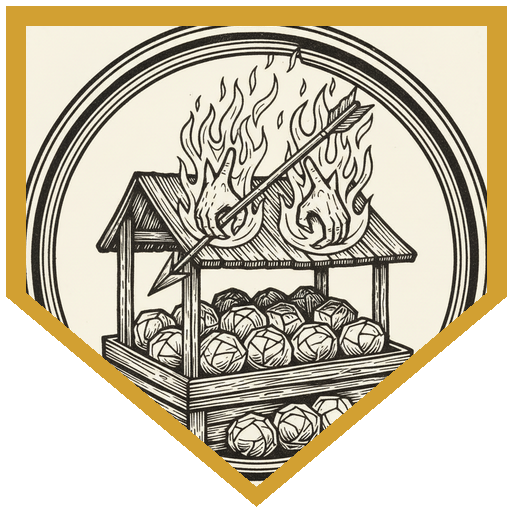
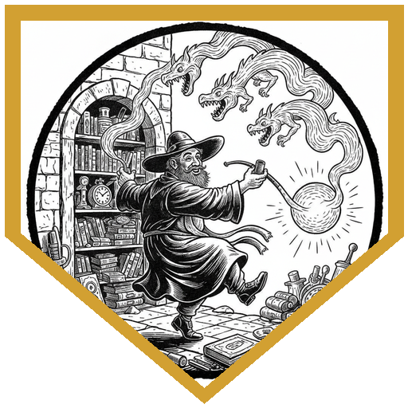
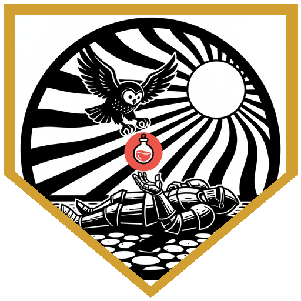
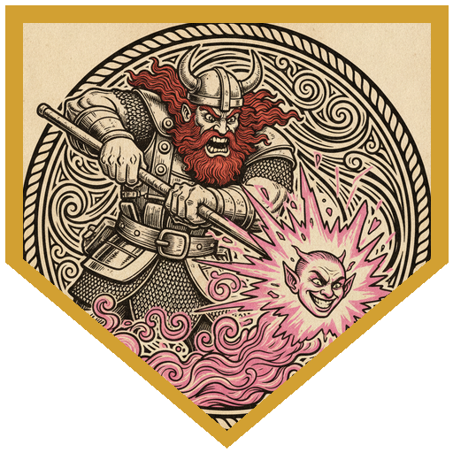
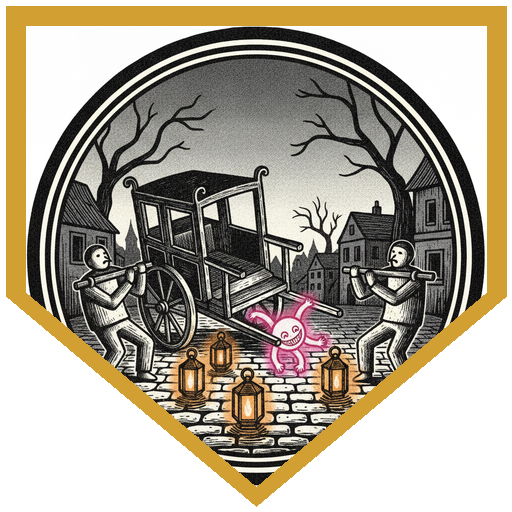

Luskan lives in the shadow of the Host Tower of the Arcane, so a strange flash in the market is not news. A bird made of fire gliding down over the stalls is almost not news. It stopped being ordinary when the bird dropped onto the cabbage seller and turned out to be a pair of hands, burning, with fingers for feathers, and a second pair came in behind it and started setting fire to the stalls. Inishka's first thought was that she hoped it wasn't one of her experiments again. Halite got there first and hit one for his maximum damage; Dru Go Lucky's Starry Wisp did the exact two points it had left. Brogladeen reached for his waterskin before he realized this fire was moving like a creature, then switched to scimitar and short sword for ten. Viepo put an arrow through the last one, and nobody asked how an arrow puts out a fire. As it died, motes of magic streamed up out of the ashes and into a book carried by a chubby young man running up the street, who was very glad no one was hurt and very sorry about the cabbages.

He was Breeze Soak, an apprentice wizard. There had been a surge while he was trying to preserve his spellbook, and thirteen spells had jumped out of it and scattered across the city. They were, he admitted, somewhat sentient. Smash them and they come back to the book, which is where they belong. He handed over the list, first-level wizard spells, and offered twenty gold a head, minus whatever the spells broke before they were caught. The party split up to ask around. Axeforger went to a temple and came back with a 21, Brogladeen with a 22, and the trail led to an elf named Faelar Perrel running out of his antique shop with a gout of flame at his back. Inside, a ball of glittering light was hopping from object to object, polishing some and destroying others. Halite tried to grab it and his hand went straight through. Axeforger held out his Pipe of Smoke Monsters and the light came over to play with the smoke, so he danced backward out of the shop holding the pipe out like a lure while Inishka threw Prestidigitation sparks on top, and it followed them out. The final count: one silver candle snuffer polished, one brush set cleaned, and a portrait, a wicker chair, and a Dwarven rug destroyed. ("Dwarven rug? A fiend.") Faelar was grateful enough to pay fifteen of the twenty.

By sunset the lanterns were being lit, and a crowd came down the street carrying a small man on a chair. His smile was too wide for his mouth. When a woman in the crowd screamed and shook her head, he laughed, had her removed, and pointed at a man to take her place; the man smiled a glazed smile and did, and the small man glowed and grew a little. Charm Person. Nobody could be sure the rider wasn't a real person underneath, so everyone went non-lethal. Brogladeen dashed in, ran through two opportunity attacks, and went down under the crowd's scimitars. Halite saw it and raged. Axeforger cast Spare the Dying on the way past. Dru handed a greater healing potion to Wise Old, his owl familiar, who carried it the rest of the way and put Brogladeen back on his feet at full health. Inishka worked the crowd with Persuasion, and one charmed townsperson after another stopped fighting and started rubbing their temples. Halite's reckless swing at the rider landed wrong. It wasn't flesh, and it wasn't a halfling; it was the spell. Axeforger shield-bashed a bearer into the dirt. Brogladeen shoved the front bearer aside, the chair tipped over, and the spell went sprawling on the cobbles, demanding to know how they dared move it from its proper place. Inishka hit it with a thunder Sorcerous Burst, which it had no answer for, and Brogladeen, with Wise Old's help, landed the blow that broke it into wisps.

Breeze Soak listened to the whole story and shook his head. Prestidigitation and Charm Person, he said, should not have been able to do that. Growing? There was something else at work besides spells running wild, and he would have to tell his teachers. He paid them, handed over a jug he'd made as a student project in case they could use it, and mentioned that there were still more spells loose in Luskan. He might need them again.

---

## Player Highlights

<strong><a href="../characters/inishka">Inishka</a></strong> (Patman) — A young sorcerer with an old soul, raised among the spellcasters who guard regions without relying on the gods, and still learning to keep her own magic on a leash. She told Breeze Soak he might get further if he spent less time thanking the goddess of magic and more time controlling his spells, then admitted she was working on that herself, and closed her fist to keep a whirl of Prestidigitation leaves under control. She used the same cantrip to throw sparks after the runaway Prestidigitation spell and lead it out of the shop. At the chair, she talked the charmed townsfolk out of it one by one with Persuasion, then found out mid-fight that she had Innate Sorcery and used it to land a thunder Sorcerous Burst, which the spell had no defense against.

<strong><a href="../characters/halite">Halite</a></strong> (Mike) — Once a dwarf farmer famous for his blackroot turnips, until a black dragon flattened the farm. He opened the night by charging the first living Burning Hands and hitting for his maximum damage. He tried to grab the glittering light in the antique shop and got nothing but air. When Brogladeen went down he raged, ran across the map, and ran out of turn. The next round he attacked "non-lethally, recklessly" ("That's a lot of adjectives") for 12, and the hit didn't land like a hit on flesh. That's how the party learned the rider on the chair was the spell and not a person.

<strong><a href="../characters/dru-go-lucky">Dru Go Lucky</a></strong> (Don) — Adoptive brother of <a href="../characters/pal-go-lucky">Pal</a> and <a href="../characters/happy-go-lucky">Happy Go Lucky</a>, back from a long break with six-leaf clovers and a goodberry for everyone, and a singing, sentient clover named Lucky peeking out of his pack. His Starry Wisp did the exact two points the first Burning Hands had left. At the chair it missed three times in a row. That didn't matter much, because Wise Old the owl did the real work: a Help action every round, then a greater healing potion taken from Dru's hand and flown to Brogladeen, who had been unconscious since the charmed crowd dropped him.

<strong><a href="../characters/axeforger">Axeforger</a></strong> (Michael) — A dwarf cleric who fights with a shield and offered Viepo a conversion pamphlet within a minute of meeting him. He rolled a 21 asking around at a temple, then solved the antique shop by dancing out of it with his Pipe of Smoke Monsters held out like a lure. At the chair he cast Spare the Dying on Brogladeen on the way in, then told a charmed bearer "Stand aside, son" and shield-bashed him onto his back: "And stay down!" A charmed former haberdasher cut him for five with a scimitar he clearly didn't know how to hold, and Axeforger answered, "You can do better than that, lad," then knocked him out.

<strong><a href="../characters/viepo">Viepo</a></strong> (Pete) — A shadar-kai arcane archer fresh from a green wormling and a museum heist, a little devious, with fast hands. Axeforger's pamphlet offer got a raised eyebrow. His arrow put out the last of the burning hands, and the DM declined to explain the physics. At the chair he missed with the short sword, used Action Surge to swing again, and hit, holding back so the charmed bearer ended up bloodied but still standing, and came back the next round to bloody another.

<strong><a href="../characters/brogladeen">Brogladeen</a></strong> (Ttrpger) — A half gem dragon, half fire giant paladin with no spells yet, sent north by an efreeti his tribe doesn't know it worships. His first instinct against a living fire was his waterskin. He was the first one to the chair and the first one down, then woke up to an owl, said "Thank you, owl," and got back in. His first swing hit a townsperson who dove in front of the rider. Then he shoved the front bearer so the chair and its rider tumbled onto the cobbles ("How dare you move me from my proper place!"), laid hands on himself, and with Wise Old's help landed the blow that broke the spell apart.

---

## Achievements

<strong>Don't Question the Arrow</strong> — The last living Burning Hands was bloodied and still setting the market on fire. Viepo nocked an arrow, let it fly, and the fire went out. The DM's ruling: "We're not gonna try and question how an arrow managed to put an entire thing of fire out, but it does."

<strong>Smoke and Sparks</strong> — The glittering light couldn't be grabbed, and every second it stayed in Faelar Perrel's shop cost him something. Axeforger held out his Pipe of Smoke Monsters, Inishka added Prestidigitation sparks, and the dwarf danced backward out the door with the spell following the show. Faelar saved his candle snuffer and brush set, and Axeforger has never once regretted carrying a novelty pipe.

<strong>Special Delivery</strong> — Brogladeen was down in the middle of the charmed crowd. Dru couldn't reach him, but Wise Old could: he took a greater healing potion from Dru's hand, flew it over, and put the paladin back at full hit points. Brogladeen's first words: "Thank you, owl."

<strong>Non-Lethally, Recklessly</strong> — Still furious about Brogladeen, Halite declared a reckless, non-lethal attack on the grinning rider ("That's a lot of adjectives") and hit for 12. The blow landed wrong. Whatever was sitting in that chair wasn't made of flesh: it was the spell, not a halfling, and everyone could stop holding back.

<strong>Remove Them From Their Proper Place</strong> — Brogladeen didn't go for the rider. He shoved the front bearer, the Dex save failed, and the whole chair went over with Charm Person tumbling out onto the cobbles. It stood up sputtering: "How dare you move me from my proper place! Boys, get him!"

---

## Rewards

- **Gold**: 40 gp (15 gp from Faelar Perrel for the antique shop, out of a possible 20, plus a 25 gp share of Breeze Soak's 150 gp payment)
- **Downtime**: 10 days
- **Advancement**: level (optional)
- **Streaming hours**: 2
- **Alchemy Jug** *(wondrous item, uncommon)*: added to every player's available magic items list. One of Breeze Soak's student projects, handed over with the gold "in case you could use it." As an action, name a liquid and the jug starts producing it; uncork it as an action to pour up to 2 gallons per minute. Once it starts on a liquid, it can't make a different one, or more of one that has hit its limit, until the next dawn. Limits: acid (8 oz), basic poison (½ oz), beer (4 gal), honey (1 gal), mayonnaise (2 gal), oil (1 qt), vinegar (2 gal), fresh water (8 gal), salt water (12 gal), wine (1 gal).
