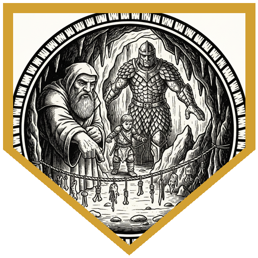
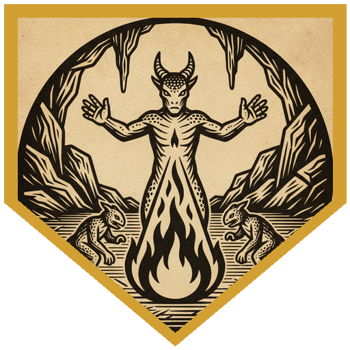
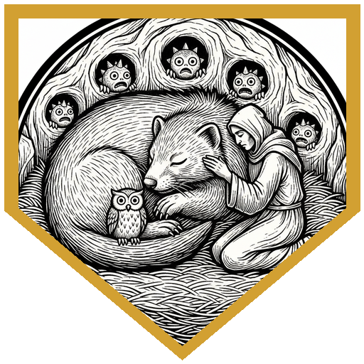
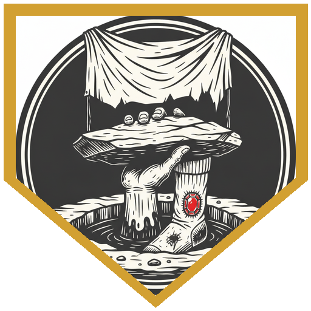
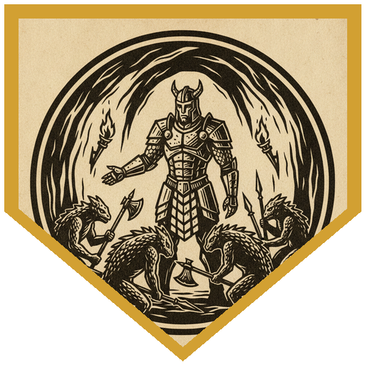

The party was on the road back from the Host Tower of the Arcane when the sky turned, and with Blazingdell too far to reach before the storm, they made camp under the trees. The sharp-eyed players were able to spot kobolds creeping in from the far corner of the map with weapons out and a winged kobold hanging above the treeline. Dru's Starry Form archer hit the flier for 9 radiant, Viepo's arrow crit it for 15, and Brogladeen's thrown vial of acid added 8. Kitrix called up a wildfire spirit, then Create Bonfire to burn down a second kobold, and Nia dashed in and killed the one in the middle with an 18. Axeforger's Toll the Dead finished the flier, rolling a d12 because it was already wounded. The only damage on the party's side was 6 from a kobold arrow to Nia.

The bodies yielded about eight gold, a potion of healing, a half-eaten mouse, a silver stud earring on the flier, and a satchel holding the journal of a man named Tholm Hurek. It came with a map marked with Blazingdell and a mountain called Stone Tooth, and Tholm's last entry said he had found a tunnel into the mountain that would spare him "all that pesky mucking about with orcs." The party could go back to town, two days away, or follow the map. "I say we push on, boys," Axeforger said, and nobody argued. They slogged through bug-ridden marsh to a cleft behind thick undergrowth, and beside the cleft lay Tholm, dead of kobold weapons. Axeforger gave him last rites; Kitrix suggested burning the body respectfully. Inside, Axeforger's passive Perception caught a tripwire strung with bones and metal scraps, and he pointed down at it and stepped over it without a word. Brogladeen snapped his fingers at Nia and pointed the same way. A second wire, which Axeforger found with a 24, ran to catches overhead. The passage was built for small creatures, and the medium-sized members of the party squeezed through it while Viepo and the other small characters walked.

In a den of damp straw, kobold graffiti, and chest-high holes in the walls, two kobolds were feeding a giant weasel the size of a large dog. Dru cast Animal Friendship, DC 13, and told everyone to leave the weasel alone, then had Wise Old fly past it so the next attack would have advantage. Brogladeen vaulted a rock and killed a kobold in one round. Viepo asked whether they looked hostile and got the answer "They look terrified." Kitrix's Burning Hands killed three more with 5 damage each. The weasel, which was now a friend to Dru and to the kobolds but not to the rest of the party, rushed to protect its friends from the murderers. The party knocked it out instead of killing it, and Dru said, "Well, we spared the weasel, so we're not so bad." Further along, Axeforger put a foot through a canvas pit cover and fell for 8 damage in murky water, with sharpened stakes at the bottom. The canvas, he found, said on the side facing the pit, "Nothing under here, don't look." Dru climbed down, found a flat rock set aside from the rest, and under it a sock, which hid a garnet inside a sewn patch. Then the kobolds started shouting in Draconic about the party's lineage, and a wad of pink goo was thrown from a hole in the wall and bounced off Axeforger. Dan called it self-pity putty.

More kobolds rushed out of the wall holes, and Brogladeen, who speaks Draconic, said there were more on the other side. Persuasion was a hard call after the party had come in killing, so he went with deception at disadvantage, and with Guidance he still rolled a 15: the first kobolds had attacked first, and they hadn't looked right. The kobolds had come to negotiate their way past the party, and they had a grievance of their own. The party had killed *Bob* (Generic Kobold Commoner) and *Francine* (the pet giant weasel, who was only knocked out), and that was a hard thing to talk around. They understood the party hadn't come to harm them, but their boss wouldn't let it pass without answering, so they agreed to take the party to him. The boss was Sik'garuk, a kobold scale sorcerer of draconic heritage, black-scaled with the beginnings of wings, three feet tall in body and "eight feet tall in spirit," with two winged scouts overhead and two more scouts and an inventor behind arrow slits. Dru's Spike Growth blocked more of the party's lines of sight than the kobolds', so he dropped it at once. Kitrix's wildfire spirit appeared beside Sik'garuk and burned two kobolds for 12 each. Nia's strike made her the target, and Sik'garuk answered with an acid burst, 31 on a failed save and 15 on a success, and Dru took 15 behind half cover. Axeforger announced "Step aside boys, step aside, there's healing to be done." Then Toll the Dead, with a d12 on a target already hurt, killed Sik'garuk. Viepo bloodied the last winged scout, which fled up the chimney toward parts unknown. The surviving kobolds were willing to let the party take what it wanted, and they would keep guarding their territory.It ended with the question the table had been circling: with a dead man at the entrance and a warren behind it, which side of that had they been on?

---

## Player Highlights

<strong><a href="../characters/dru-go-lucky">Dru Go Lucky</a></strong> (Don) — His Animal Friendship made the giant weasel a friend, but not the rest of the party's. His owl Wise Old flew past it so everyone else got advantage on the attack. He dug the sock out of the flooded pit and found the garnet in it. He tested Spike Growth, which he had just learned, on Sik'garuk's room and dropped it immediately, since it was blocking his own side more than the kobolds.

<strong><a href="../characters/axeforger">Axeforger</a></strong> (Michael) — A life cleric with a shield, healing for the party and, per Michael, "not slept in three days." His Toll the Dead killed the winged scout at camp and Sik'garuk at the end, both targets already wounded, so he rolled d12s. He spotted the second tripwire with a 24, fell through the canvas and took 8 from the stakes, and when Dan asked whether he'd obey the sign, said "I'm not going to look down there." He cast Bless twice on the first three in line.

<strong><a href="../characters/nia">Nia</a></strong> (Lazarus) — A seasoned warrior cursed by a devil into a child's body and looking for a way to undo it. She dashed in on the opening round and killed a kobold with an 18, and at the den she killed another with a 13 and an astral arm strike. In the boss room she struck for 7 and drew Sik'garuk's attention to the corner, where he answered with the acid burst. At the end of the first fight she took 6 from a kobold arrow, the only damage she took before the boss.

<strong><a href="../characters/viepo">Viepo</a></strong> (Pete) — A shadar-kai arcane archer proud of the alchemy jug from last week. His arrow crit the winged scout at camp for 15, and he took another 11 off a kobold at the den after asking whether they looked hostile. In the boss room two scouts shot at him with arrows that rolled a 5 and a 10 against his AC 16. He hit the last winged scout for 9 and used Second Wind before it flew up the chimney.

<strong><a href="../characters/brogladeen">Brogladeen</a></strong> (Ttrpger) — A half gem dragon, half fire giant paladin who speaks Draconic, and tonight the party's diplomat. He threw a vial of acid at the winged scout for 8, vaulted a rock to kill a kobold at the den, and warned the kobolds in Draconic that there were more on the other side. He talked the kobolds out of fighting with a deception roll of 15 at disadvantage ("Take us to your boss").

<strong><a href="../characters/ith-kitrix">Ith Kitrix</a></strong> (Patman) — A kobold wildfire druid on a pilgrimage to a volcano that didn't pan out, and hoping Stone Tooth would be one. She called up the wildfire spirit twice and followed it with Create Bonfire, and in the den her Burning Hands killed three kobolds with a roll of 5 each. In the boss room the spirit burned two scouts for 12 apiece, and she kept tiptoeing around Dru's Spike Growth for a round after it was gone.

---

## Achievements

<strong>Say Nothing, Step Over</strong> — A tripwire hung with bones and scraps of metal crossed the tunnel, and anyone who pulled it would have rattled the whole warren. Axeforger spotted it and pointed down without a word, Brogladeen snapped his fingers at Nia and pointed, and the party stepped over it in silence. Axeforger's 24 found a second wire running to catches overhead.

<strong>Breathes Fire Like a Mighty Dragon</strong> — "I'm about to breathe fire like a mighty dragon," Kitrix announced, and caught three kobolds in a 15-foot cone of Burning Hands. A 5 on the damage roll was enough to kill all three. "Well, they were looking to kill us, I'm pretty sure."

<strong>The Weasel Is Our Friend</strong> — Dru's Animal Friendship made the giant weasel his friend and the kobolds' friend, which meant it charged the party when the fighting started. The party knocked it out instead of killing it. "Well, we spared the weasel, so we're not so bad."

<strong>Nothing Under Here, Don't Look</strong> — Axeforger fell through a canvas pit cover into a flooded trap, and the canvas told him what was under it on its pit side: "Nothing under here, don't look." Dru climbed down, looked anyway, and found a rock set aside from the rest. Under it was a sock, and in a patch sewn into the sock, a garnet.

<strong>Take Us to Your Boss</strong> — After the party had come in killing, Brogladeen spoke to the kobolds in Draconic and rolled a 15 on deception at disadvantage. The kobolds' complaint was that the party had killed *Bob* and *Francine*, so they weren't giving ground cheaply. They agreed the party wasn't there to harm them, and said their boss wouldn't let it pass without a conversation. "All right, take us to your boss." It skipped two fights.

---

## Rewards

- **Gold**: 54.83 gp each (from the chunk of onyx off Sik'garuk, the winged scout's silver stud earring and coin, and the garnet from the sock, divided between the party)
- **Downtime**: 10 days
- **Advancement**: level (optional)
- **Streaming hours**: 2
- **Cloak of Protection** *(wondrous item, uncommon, requires attunement)*: added to every player's available magic items list. +1 to AC and saving throws while worn. Tattered patched canvas stitched together with coarse twine, with a saucer-sized black dragon scale hanging over the chest, glossy and bearing the sigil of Nightscale.
- **Potion of Healing** *(potion, 50 gp)*: added to every player's available list. Regain 2d4 + 2 hit points; drinking or administering takes an action.
- **Potion of Acid Resistance** *(potion, uncommon)*: added to every player's available list. Resistance to acid damage for 1 hour.
- **Spell Scroll of Invisibility**: added to every player's available list.
