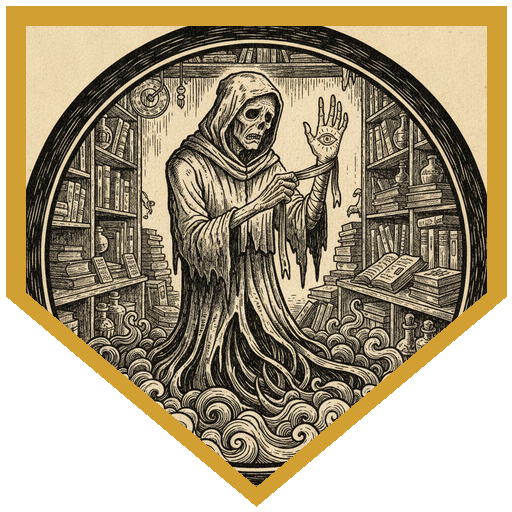
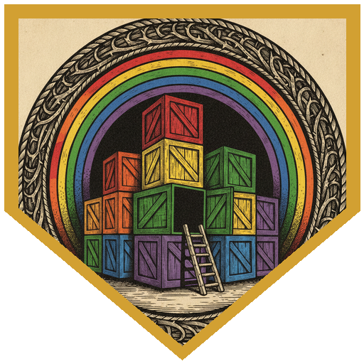
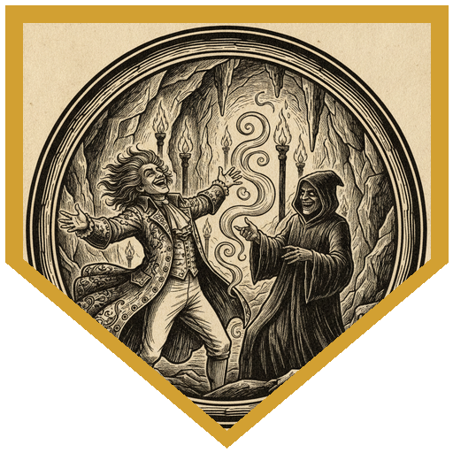
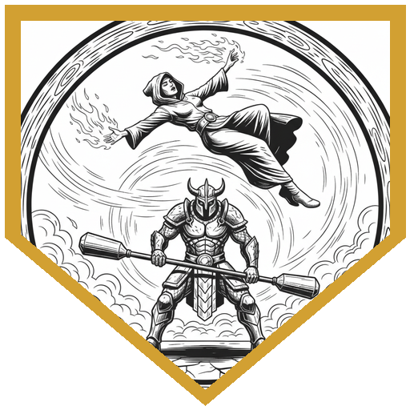
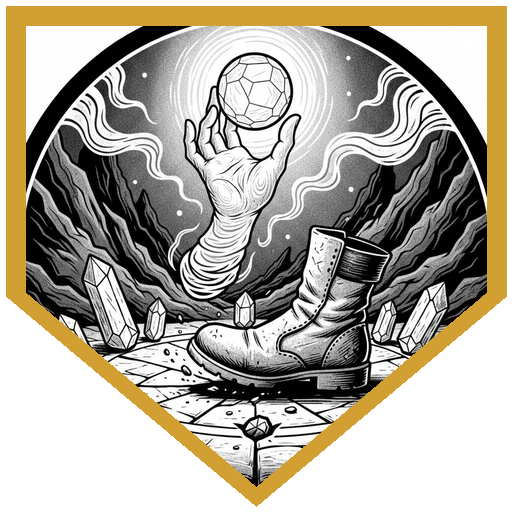

Breeze Soak was late to his own meeting. The rotund apprentice wizard came into the back room of the Magic Drum with his arms full of papers and maps, dropped half of them, and explained between apologies that his spellbook-preservation ritual had done the opposite of what he wanted: the spells had come out of the book and started running loose in Luskan. He offered 70 gold to anyone who could track them down. Dru Go Lucky handed out six-leaf clovers and goodberries to everyone, Breeze included. Teeli wanted to know exactly what "animated" meant. Halite pointed out that none of these spells had been as simple as beating them up. Don Kenonji told the young wizard not to worry, because the Luskan Five were here. There were six of them. Dru helped gather the papers and turned up a 17 on Perception: research on the Weave, maps of where the spells had been caught, and backup scrolls of Sleep, Magic Missile, and Mage Armor. The ritual scroll had come from a shop called the Whispered Tome, in Rat Alley.

The Whispered Tome sat next to a burned-out tavern whose charred sign still read *The Fried Rat*. Inside, books were strewn across the floor, a suit of plate armor stood in the corner, and Wilbur Watley sat at his desk with a bandage over his left hand. Halite went in first: "Here, spelly spelly." Brogladeen leaned on the counter and suggested Wilbur loosen his lips for a client's friends. Wilbur kept scratching furiously at one eye and covering it with the bandaged hand. Teeli offered to look at the injury ("a nasty paper cut"), and Wilbur gave up the act: what they wanted was over behind that armor, if one of them would move it. Halite saw the armor standing next to Jorin, raged, and hit it for 14. Jorin put Hunter's Mark on it and shot it point-blank for a 23, and it looked almost dissipated. Don Kenonji named Brogladeen "Luskan Blue" and handed him Bardic Inspiration. Brogladeen was more interested in whether Wilbur was another Disguise Self. He brushed past the man's robe and found a real human. He drew his scimitar, hit, and put a Thunderous Smite through the short sword for six thunder. Wilbur's spiritual dagger went for Teeli and missed, and she splashed acid on Wilbur for six. Dru went into his starry archer form and crit the armor with a Luminous Arrow, which finished it. A second cultist ran out of the back room, missing a hand and an eye on the same side. Then Halite, in the aspect of the wolf, hit Wilbur recklessly for 12 and caught him with the butt of the glaive for the last six. Wilbur tore the bandage off his hand to show the eye of Vecna, cried that Vecna was the true god of magic, and he and the other cultist burned away in black flame. ("Mystra might want to have something to say about that," Jorin observed.)

Teeli's Religion check came up a 17, enough for the history of Vecna, the One Eye and the One Hand. Brogladeen's thieves' tools opened Wilbur's lockbox on a 13, just enough, and inside were silver and an obsidian dagger. Wilbur's note sent the living spell to a warehouse on Dragon's Beach, behind a riddle of coloured boxes. Halite said "green" almost immediately. Don Kenonji walked it through: the rainbow, orange as the child of red and yellow, and Dru finished it with yellow and blue making green. Ken also pointed out that this only works with paint, not light. The party briefly planned to dress someone up as the armor and walk in as Wilbur's delivery. Nobody owned full plate, so Dru suggested they just surprise the cult instead. The ladder was in the green box.

The hideout below had been shaped, not dug. Past the hanging blankets came chanting that Teeli understood: Draconic, praising Vecna. Lavinia, a mage apprentice, led the ritual inside a circle of glowing crystals with three fanatics and two cultists around her. Jorin went first, with advantage from Halite's wolf aspect, and hit Lavinia on a 26. Two fanatics tried Hold Person on Halite and he saved against both: "You're tanking spells." Brogladeen, with a Strength of 8, made a long jump across the ritual circle, landed it, and hit Lavinia on a 24. Don Kenonji boomed "Hello boys and girls! Spirits are always with you!" and cast Hideous Laughter on a cultist, who laughed back, wickedly. Teeli let out a Draconic Cry that gave everyone around her advantage. Lavinia circled behind Brogladeen and caught him with Burning Hands. He used his Luskan Blue inspiration to make the save, then answered with his Gift of the Gem Dragon: 12 force damage, a ten-foot shove, and Lavinia didn't get up. Jorin, Halite, Dru's Guiding Bolts and Brogladeen's blades worked through the rest. Brogladeen laid hands on himself and offered the last fanatic a chance to surrender, and the fanatic answered that Vecna was the only true god of magic. The storage room held a Hat of Disguise for each of them, an unholy symbol of Vecna, and a leather map with a cipher none of them could read. Teeli lifted the crystals out of the circle with Mage Hand while Jorin scuffed the circle out with his boot. Nothing happened, which may or may not have been thanks to them. Breeze heard about the Cult of Vecna with genuine horror, and promised to take the map to the Arcane Brotherhood.

---

## Player Highlights

<strong><a href="../characters/teeli">Teeli</a></strong> (Allison) — A kobold artificer considered elderly by her clan, who left her underground home in kobold middle age, about fifteen, to see the world. Allison came to the table wanting to try the artificer. Teeli asked the questions that moved the night along: whether the spells were truly alive, and what had happened to Wilbur's hand, which got the "paper cut" and the end of his act. Her acid splash hit Wilbur for six. In the hideout she was the one who understood the Draconic chanting, and her Draconic Cry gave the whole party advantage on everyone around her. At the end she lifted the crystals out of the circle with Mage Hand, just to be safe.

<strong><a href="../characters/halite">Halite</a></strong> (Mike) — A turnip farmer turned mercenary, playing his first barbarian. He saw the armor standing next to Jorin, raged, and hit it for 14. Then he took Wilbur's last hit points with a reckless glaive swing and a jab with the butt. In the hideout his wolf aspect gave Jorin advantage on the opening shot, and he saved against two Hold Persons in a row. His reckless 12 finished Fanatic A. He also made sure to ask about the three spell scrolls, "for a friend."

<strong><a href="../characters/dru-go-lucky">Dru Go Lucky</a></strong> (Don) — He came in with six-leaf clovers and goodberries for everyone, his peppermint pangolin stowed somewhere safe. He helped Breeze with his papers and found the backup scrolls. In starry archer form he crit the Living Mage Armor with a Luminous Arrow, which destroyed it. Wise Old fluttered in cultists' faces all night to hand out advantage. Dru spent all three Guiding Bolts in the hideout, and the last, upcast to 2nd level, took out a fanatic on 19 damage.

<strong><a href="../characters/don-kenonji">Don Kenonji</a></strong> (Ken) — A bard who wants to be famous, and is sure the spirits are behind every strange thing in Luskan. He introduced the party as the Luskan Five (to a party of six), named Brogladeen "Luskan Blue" and Teeli "Luskan Red" with Bardic Inspiration, and walked the table through the colour riddle. In the hideout he boomed "Hello boys and girls! Spirits are always with you!", which got a laugh out of a cultist, though not the irresistible kind. Then he cast Shillelagh, called it the Super Spirit Stick, and bopped a fanatic to "pry the bad spirit out." At the end he worked out the split to the copper: 26 gold, 8 silver, 3 copper each.

<strong><a href="../characters/jorin">Jorin</a></strong> (Trey) — A northern ranger who spends his time with the cold dwarves, playing from his phone. He went in point-blank with Hunter's Mark and his longbow, and on a 23 left the Living Mage Armor almost dissipated. He opened the hideout fight with a 26 on Lavinia, finished Cultist A for 17, and bloodied a fanatic for Dru to finish. When Brogladeen offered the last fanatic a chance to surrender, Jorin supplied the fanatic's side: "He's like a tall glass of water."

<strong><a href="../characters/brogladeen">Brogladeen</a></strong> (Ttrpger) — The half gem dragon, half fire giant paladin was back in Luskan with Dru and Halite. He suspected Wilbur was another living Disguise Self and checked by brushing past his robe, then hit Wilbur with a Thunderous Smite. His thieves' tools opened the lockbox. In the hideout he made a long jump across the ritual circle on a Strength of 8 and hit Lavinia on a 24. When she burned him, he made the save and threw her ten feet with a telekinetic reprisal that ended her. He offered the last fanatic surrender before finishing him.

---

## Achievements

<strong>A Nasty Paper Cut</strong> — Halite, in the aspect of the wolf, hit Wilbur Watley recklessly for 12, then caught him with the butt of the glaive for exactly the six he had left. Wilbur tore off the bandage to show the eye of Vecna, cried that Vecna was the true god of magic, and he and his one-handed, one-eyed accomplice burned away to dust.

<strong>The Child of the Third and Fifth</strong> — Twelve painted boxes, five of them alarmed, and a riddle about rain touching light. Halite said "green" almost at once. Don Kenonji worked through the rainbow and Dru supplied the yellow and blue, then Ken pointed out the catch: those colours only mix in paint, not in light. The DM agreed the riddle was cruel. The ladder was in the green box.

<strong>Hello, Boys and Girls!</strong> — Don Kenonji came into the hideout booming "Spirits are always with you! Bwahaha!" and cast Hideous Laughter on a cultist. The cultist laughed, but it was a wicked laugh, not the irresistible kind. Don's diagnosis: "Must have good taste in children's programming."

<strong>Return to Sender</strong> — Lavinia walked around behind Brogladeen and hit him with Burning Hands. He spent his Luskan Blue inspiration to make the save and answered with his Gift of the Gem Dragon: a DC 15 Strength save, 12 force damage, and a ten-foot shove. She didn't get up.

<strong>Abundance of Caution</strong> — The ritual was broken, but the crystals were still sitting in the circle. Teeli picked them up with Mage Hand, at a safe distance, while Jorin scuffed the circle out with his boot. Nothing bad happened. Whether that was because of their caution, the DM said, "you'll never find out."

---

## Rewards

- **Gold**: 26.83 gp (161 gp split six ways; Don Kenonji has it as 26 gp, 8 sp, 3 cp, and he keeps the leftover copper)
- **Downtime**: 10 days
- **Advancement**: level (optional)
- **Streaming hours**: 2
- **Hat of Disguise** *(wondrous item, uncommon, requires attunement)*: added to every player's available magic items list. Found in the cult's storage room, one for each of them. While wearing it, you can cast *Disguise Self*; the spell ends if the hat is removed. Whatever kind of hat it pretends to be, it always keeps a mauve tint.
- **Spell Scrolls** of *Sleep*, *Magic Missile*, and *Mage Armor* (1st level): added to every player's available list. Wilbur Watley wasn't lying about his stock.
