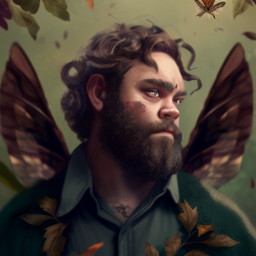

# Rool
## Campaign: Wild Beyond the Witchlight
### Location: in-person
### DM: Kate Hoff

This is all placeholder information until I have time to type more.

Rool is loosely based on the brownies from the movie Willow.

Rool has gone on an adventure before, he rescued a lost infant child along with another member of his
group of faeries. Despite the fact that others thought of him as a hero, he felt no sense of accomplishment
from that task. He's now looking for bigger things to do, so that he can prove himself to be worth the 
praise that he received from his group.

But so far, nothing he's tried has given him that.

That may change now that he's been introduced to actual adventurers.

* [Character Sheet](https://ddb.ac/characters/73151462/6veXru)
* Session notes
  * [Session 00](session_notes/Wild%20Beyond%20the%20Witchlight%20Session%2000%202022-08-25%20%5BD&D%5D.pdf): [transcription]
  * [Session 01](session_notes/Wild%20Beyond%20the%20Witchlight%20Session%2001%202022-09-01%20%5BD&D%5D.pdf): [transcription]
  * [Session 02](session_notes/Wild%20Beyond%20the%20Witchlight%20Session%2002%202022-09-08%20%5BD&D%5D.pdf): [transcription]
  * [Session 03](session_notes/Wild%20Beyond%20the%20Witchlight%20Session%2003%202022-09-15%20%5BD&D%5D.pdf): [transcription]
  * [Session 04](session_notes/Wild%20Beyond%20the%20Witchlight%20Session%2004%202022-09-22%20%5BD&D%5D.pdf): [transcription]
  * [Session 05](session_notes/Wild%20Beyond%20the%20Witchlight%20Session%2005%202022-09-29%20%5BD&D%5D.pdf): [transcription]
  * [Session 06](session_notes/Wild%20Beyond%20the%20Witchlight%20Session%2006%202022-10-06%20%5BD&D%5D.pdf): [transcription]
  * [Session 07](session_notes/Wild%20Beyond%20the%20Witchlight%20Session%2007%202022-10-20%20%5BD&D%5D.pdf): [transcription]
  * [Session 08](session_notes/Wild%20Beyond%20the%20Witchlight%20Session%2008%202022-11-03%20%5BD&D%5D.pdf): [transcription]
  * [Session 09](session_notes/Wild%20Beyond%20the%20Witchlight%20Session%2009%202022-11-10%20%5BD&D%5D.pdf): [transcription]
  * [Session 10](session_notes/Wild%20Beyond%20the%20Witchlight%20Session%2010%202022-11-17%20%5BD&D%5D.pdf): [transcription]
  