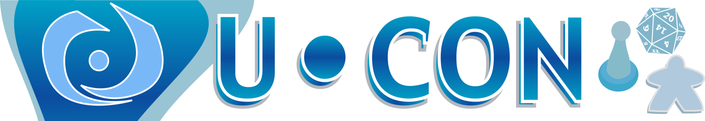

# U-Con 2026 — DM Volunteer Page

**U-Con Gaming Convention · November 13–15, 2026**
Ann Arbor Marriott Ypsilanti Hotel at Eagle Crest

---

## Volunteer to Run Games

This year we're running both **Adventurers League** and **Legends of Greyhawk** organized play at U-Con. We have room for both tracks and we'd love to have you at the table — whether you're a returning DM or someone who's never run for us before.

If you're interested in volunteering, please fill out the form below. It's not a firm commitment — right now I'm in gauge-of-interest mode, and everything is still flexible.

  <a class="lp-btn ghost" href="https://forms.gle/9TKfozyVMj97rdyX9" target="_blank" rel="noopener">
    Fill Out the DM Interest Form →
  </a>

---

## What to Expect

- **8 slots** across the weekend (Fri/Sat/Sun, morning/afternoon/evening)
- **Adventurers League** adventures across multiple tiers
- **Legends of Greyhawk** adventures — 9 confirmed, possibly more by November
- **Epic** (multi-table event) typically runs Saturday evening
- **Charity rerolls** benefiting Doctors Without Borders
- **Badge incentives** for volunteering — details to be confirmed, but historically 2 slots earns a discount and 4 slots earns a free weekend badge

---

## Running Your Own Adventure

If you have an Adventurers League DungeonCraft or other AL-legal adventure you'd like to run, we'd love to feature it! Mention it on the form or [reach out directly](mailto:chapmand@gmail.com) if you'd like to talk through what's possible.

---

## Health & Safety

U-Con's official health and safety policies are at [ucon-gaming.org/policies](https://www.ucon-gaming.org/policies/). We ask everyone to prioritize their health and the health of those around them. If you're feeling unwell, please stay home. No table is worth getting people sick, and we'd much rather sort out coverage than have anyone push through it.

---

## Questions?

Reach out any time. I genuinely love talking about this.

- **Email:** chapmand@gmail.com
- **Discord:** hoshisabi · [Join the server](https://discord.gg/4x7p2NPs4Q)
- **Web:** [hoshisabi.com](https://hoshisabi.com) · [pandodnd.com](https://pandodnd.com)

---

## Past U-Cons

Thank you to everyone who has volunteered or played at our tables over the years. This room has been running strong almost a decade and exists because of the people who keep showing up.
