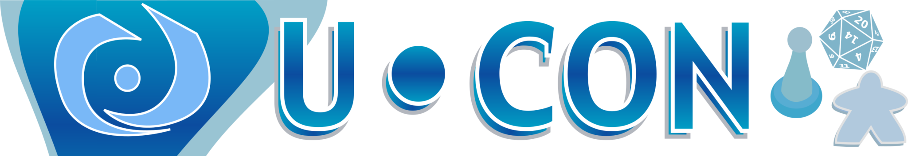

# U-Con Gaming Convention

## Thank You For Accompanying Us On This Expedition!

Thank you for attending the Adventurers League portion of U-Con, no matter whether you ran a game or if 
you played a game, you were a necessary
component for us to make sure everything happened.

Look at this site for a survey where you can leave feedback about what worked, what didn't work, 
and what you might like to see in the future!

Also look here for links to purchase any of the adventures that were run at U-Con, along with
a discount for any adventure that I might be able to give!

I look forward to seeing you next year and hopefully for many many years to come!

## Contact Dan

I'm going to post more information about discounts, how to volunteer for future U-Cons,
how to get information about Adventurers League... But not yet, today I am most likely going
to go to sleep.

But in the meantime, feel free to contact me on [Twitter](https://twitter.com/hoshisabi) or 
[Facebook](https://www.facebook.com/hoshisabi).

In addition, you can get information about our local playgroup at [PandoDnD](pandodnd.com)
or on our [Discord](https://discord.gg/4x7p2NPs4Q).

