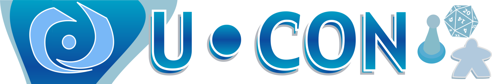



# U-Con 2026 — Adventurers League & Legends of Greyhawk

**U-Con Gaming Convention · November 13–15, 2026**
Ann Arbor Marriott Ypsilanti Hotel at Eagle Crest

---

## What We're Running

This year we're running two D&D organized play programs side by side: **Adventurers League** and **Legends of Greyhawk**.

- **{{ ucon_slot_count }} slots** across the weekend, Friday morning through Sunday afternoon
- **{{ ucon_al_count }} Adventurers League adventures** across all four tiers
- **{{ ucon_log_count }} Legends of Greyhawk adventures**
- **Epic** (multi-table event) Saturday evening
- **Charity rerolls** benefiting Doctors Without Borders

  <a class="lp-btn ghost" href="{{ '/ucon-2026-schedule/' | relative_url }}">
    View the 2026 AL / LoG Schedule Grid →
  </a>

---

## Signing Up to Play

Registration is open on [Tabletop.Events](https://tabletop.events/conventions/u-con-2026), and tables are filling as badges sell. The [schedule grid]({{ '/ucon-2026-schedule/' | relative_url }}) links each table straight to its event page.

---

## Charity

Every table offers charity rerolls benefiting **Doctors Without Borders**. Donations are collected at AL HQ during the convention.

---

## Health & Safety

U-Con's official health and safety policies are at [ucon-gaming.org/policies](https://www.ucon-gaming.org/policies/). We ask everyone to prioritize their health and the health of those around them. If you're feeling unwell, please stay home. No table is worth getting people sick, and we'd much rather sort out coverage than have anyone push through it.

---

## Questions?

Reach out any time. I genuinely love talking about this.

- **Email:** chapmand@gmail.com
- **Discord:** hoshisabi · [Join the server](https://discord.gg/4x7p2NPs4Q)
- **Web:** [hoshisabi.com](https://hoshisabi.com) · [pandodnd.com](https://pandodnd.com)

---

## Past U-Cons

Thank you to everyone who has volunteered or played at our tables over the years. This room has been running strong almost a decade and exists because of the people who keep showing up.
